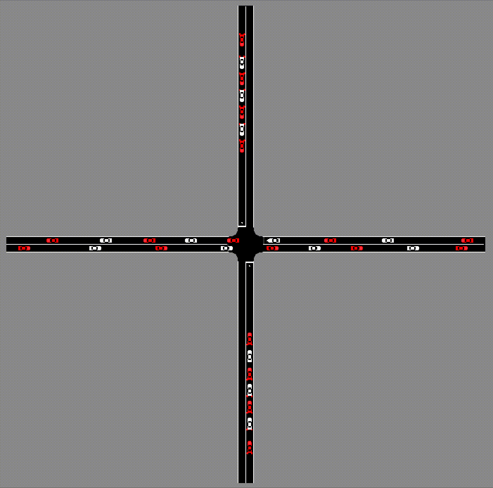
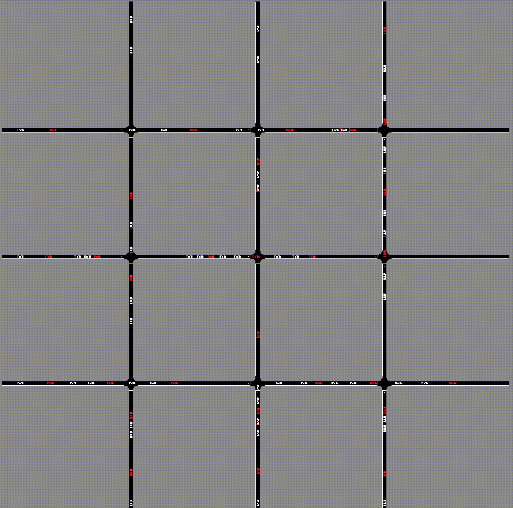

# Mixed Autonomy Intersections
This repo contains the code, model checkpoints, and video results for the ITSC 2021 paper *Reinforcement Learning for Mixed Autonomy Intersections* on [arXiv](https://arxiv.org/abs/2111.04686) and [IEEE](https://ieeexplore.ieee.org/abstract/document/9565000
).




If you'd like to cite this work, please use

```
@inproceedings{yan2021reinforcement,
  title={Reinforcement Learning for Mixed Autonomy Intersections},
  author={Yan, Zhongxia and Wu, Cathy},
  booktitle={2021 IEEE International Intelligent Transportation Systems Conference (ITSC)},
  pages={2089--2094},
  year={2021},
  organization={IEEE}
}
```

## Installation
Installation instructions are provided for MacOS and Ubuntu 14.04, 16.04, and 18.04. For microscopic traffic simulations, we use the SUMO simulator with version 1.1.0; the same code may require adjustments on other SUMO versions. We require Python 3.8+.
1. Run `bash setup/setup_sumo_<os_version>.sh` corresponding to your OS version to set up SUMO and add `~/sumo_binaries/bin` to your `SUMO_HOME` and `PATH` environment variables. Try running `sumo` and `sumo-gui` (if you'd like to use GUI). Note that GUI probably does not work on servers and may only work on local computers. For Mac installation issues, please refer to `setup/setup_issues_osx.md`.
2. Note: the previous SUMO installation actually installs a SUMO version which does not support IDM with Gaussian noise. If you'd like to use Gaussian noise (which is what we use in the paper but does not significantly affect results), you can build the forked version of SUMO 1.1.0 at https://github.com/ZhongxiaYan/sumo.
3. If needed, follow instructions [here](https://docs.conda.io/projects/conda/en/latest/user-guide/install/) to install Miniconda, likely `wget https://repo.anaconda.com/miniconda/Miniconda3-latest-Linux-x86_64.sh` followed by `bash Miniconda3-latest-Linux-x86_64.sh`.
4. If desired, create and activate a new conda environment following these [instructions](https://docs.conda.io/projects/conda/en/latest/user-guide/tasks/manage-environments.html#creating-an-environment-with-commands).
5. If needed, install PyTorch (1.7+) from [pytorch.org](pytorch.org).
6. If needed, install missing Python dependencies `pip install -r requirements.txt`.

## Training
To train a model, create an empty experiment directory `EXP_DIR` anywhere, then create a file called `$EXP_DIR/config.yaml` with the desired training hyperparameters. The training experiment directories corresponding to figures in the paper can be found in the `results` directory (ignore the subdirectories with "baseline" in the name), e.g. `results/twoway_2x1_penetration0.333`.

The hyperparameter names are mostly self-explanatory. If not, please refer to the code for clarification.

Note that the `n_workers` argument specifies the number of CPUs to run the code on (we run training on a server with 40 CPUs). Make sure you don't use more CPUs than you have.

```
# Example training hyperparameters (also see $EXP_DIR/config.yaml)
EXP_DIR=results/twoway_2x1_penetration0.333

python intersection.py $EXP_DIR
```
### Trained Models
All of our trained models used in the paper can be found in `results`, excluding the subdirectories with "baselines" in the name. The naming convention is intuitive, for example `penetration0.5` indicates 50% AV penetration.

### Finetuning
To finetune from a previous trained checkpoint (possibly from a different experiment with the same neural network architecture), place the desired model weights in $EXP_DIR before running the training command. For example, if we want to finetune `results/fourway_1x1_penetration0.333/model-200.pth` on 50% penetration in a new `EXP_DIR=results/fourway_1x1_penetration0.5`, use the following Python code to preserve the network weights while discarding other training states.
```
ckpt_path = 'results/fourway_1x1_penetration0.333/models/model-200.pth'
new_ckpt_path = 'results/fourway_1x1_penetration0.5/models/model-0.pth'

import torch
model_dict = torch.load(ckpt_path)
new_model_dict = dict(net=model_dict['net'])
torch.save(new_model_dict, new_ckpt_path)
```
Afterwards, run the training command `python intersection.py $EXP_DIR` to start training from these model weights.

We list the finetuned experiments (subdirectories of `results/`) here with the notation `<finetuned> <--- <source> (<ckpt>)`:
* `twoway_2x1_penetration0.1 <--- twoway_2x1_pretrain_penetration0.5 (200)`
* `twoway_2x1_penetration0.15 <--- twoway_2x1_pretrain_penetration0.5 (200)`
* `twoway_2x1_penetration0.333 <--- twoway_2x1_pretrain_penetration0.5 (200)`
* `twoway_2x1_penetration0.5 <--- twoway_2x1_pretrain_penetration0.5 (200)`
* `twoway_2x1_penetration1 <--- twoway_2x1_pretrain_penetration0.5_threechains_finetune_penetration1 (195) <--- twoway_2x1_pretrain_penetration0.5_threechains (170)`
* `fourway_1x1_penetration0.5 <--- fourway_1x1_penetration0.333 (200)`
All intermediate checkpoints are included in `results/`.

## Evaluation
To evaluate a trained model at an integer checkpoint `CKPT`, run
```
# Example evaluation hyperparameters
EXP_DIR=results/twoway_2x1_penetration0.333
CKPT=200
FR_H=850 # Horizontal flow rate in vehicles/hour
FR_V=700 # Vertical flow rate
N_ROWS=3
N_COLS=3
RESULT_SAVE_PATH=$EXP_DIR/eval_results/e165_3x3_skip500_flow850x700.csv

python intersection.py $EXP_DIR e=$CKPT n_rows=$N_ROWS n_cols=$N_COLS n_steps=10 n_rollouts_per_step=1 skip_stat_steps=500 flow_rate_h=$FR_H flow_rate_v=$FR_V result_save=$RESULT_SAVE_PATH
```
Any nonspecified hyperparameter defaults to the value in `$EXP_DIR/config.yaml`. Other hyperparameters that can be set can be found in the code: any attribute of `c` (see code) can be set from the command line, i.e. to set `c.lr = 0.001` from the command line, run `python intersection.py $EXP_DIR ... lr=0.001`.

In the paper, for each experiment we evaluated the checkpoint with the best performance during training. These checkpoints are
* `twoway_2x1_penetration0.1`: 155
* `twoway_2x1_penetration0.15`: 180
* `twoway_2x1_penetration0.333`: 165
* `twoway_2x1_penetration0.5`: 150
* `twoway_2x1_penetration1`: 160
* `fourway_1x1_penetration0.333`: 190
* `fourway_1x1_penetration0.5`: 170
Note that we evaluated `twoway_2x1_penetration0.333` and `twoway_2x1_penetration0.5` on both a 2x1 grid of intersections and a 3x3 grid of intersections (see their `eval_results/` subdirectories).

## Baselines
To run the priority and traffic signal baseline methods which do not require training, create an empty directory `BASE_DIR` and a `$BASE_DIR/config.yaml` with hyperparameters pertaining to all the baseline runs in that directory. Refer to `results/{twoway_2x1_baselines,twoway_3x3_baselines,fourway_1x1_baselines}/config.yaml` as examples. The commands below are similar to previous commands.

```
# Example baseline hyperparameters
BASE_DIR=results/twoway_2x1_baselines
FR_H=850
FR_V=700

# Priority (Horizontal)
python intersection.py $BASE_DIR e=0 n_steps=3 n_rollouts_per_step=1 skip_stat_steps=500 av_frac=0 speed_mode=SPEED_MODE.all_checks priority=horizontal flow_rate_h=$FR_H flow_rate_v=$FR_V result_save=$BASE_DIR/eval_results/skip500_hpriority_flow${FR_H}x${FR_V}.csv

# Priority (Vertical)
python intersection.py $BASE_DIR e=0 n_steps=3 n_rollouts_per_step=1 skip_stat_steps=500 av_frac=0 speed_mode=SPEED_MODE.all_checks priority=vertical flow_rate_h=$FR_H flow_rate_v=$FR_V result_save=$BASE_DIR/eval_results/skip500_hpriority_flow${FR_H}x${FR_V}.csv

# Traffic Signal with specified phase times
PHASE_H=25 # Horizontal traffic signal phase length in seconds
PHASE_V=25 # Vertical traffic signal phase length in seconds
python intersection.py $BASE_DIR e=0 n_steps=3 n_rollouts_per_step=1 skip_stat_steps=500 av_frac=0 "'tl=($PHASE_H,$PHASE_V)'" yellow=0 flow_rate_h=$FR_H flow_rate_v=$FR_V result_save=$BASE_DIR/eval_results/skip500_signalbest_yellow0_flow${FR_H}x${FR_V}.csv

# Traffic Signal with MaxPressure
MP_T_MIN=12 # Units are in seconds
python intersection.py $BASE_DIR e=0 n_steps=3 n_rollouts_per_step=1 skip_stat_steps=500 av_frac=0 tl=MaxPressure mp_tmin=$MP_T_MIN yellow=0 flow_rate_h=$FR_H flow_rate_v=$FR_V result_save=$BASE_DIR/eval_results/skip500_mpbest_yellow0_flow${FR_H}x${FR_V}.csv
```

We list the best hyperparameters that we found for traffic lights and MaxPressure baselines below.
### Two-way 2x1 Hyperparameters

Oracle traffic signal phase table:
|F_H \ F_V| 400      | 550      | 700      | 850      | 1000     |
|------:|:---------|:---------|:---------|:---------|:---------|
|  1000 | (25, 10) | (25, 13) | (25, 25) | (27, 27) |          |
|   850 | (25, 25) | (25, 25) | (25, 25) | (26, 26) | (26, 25) |
|   700 |          |          | (25, 25) | (25, 25) | (19, 26) |
|   550 |          |          |          | (25, 25) | (14, 25) |
|   400 |          |          |          | (25, 25) | (9, 25)  |

Equal-phase `τ_equal`: `PHASE_H=25` and `PHASE_V=25`

MaxPressure `τ_min`: `MP_T_MIN=4`

### Two-way 3x3 Hyperparameters
Oracle traffic signal phase table:
|F_H \ F_V| 400      | 550      | 700      | 850      | 1000     |
|------:|:---------|:---------|:---------|:---------|:---------|
|  1000 | (25, 10) | (25, 13) | (19, 19) | (21, 21) | nan      |
|   850 | (25, 24) | (25, 25) | (25, 25) | (26, 25) | (21, 21) |
|   700 | nan      | nan      | (25, 25) | (25, 25) | (19, 19) |
|   550 | nan      | nan      | nan      | (25, 25) | (13, 25) |
|   400 | nan      | nan      | nan      | (24, 25) | (10, 25) |

Equal-phase `τ_equal`: `PHASE_H=25` and `PHASE_V=25`

MaxPressure `τ_min`: `MP_T_MIN=6`

### Four-way 1x1 Hyperparameters
Oracle traffic signal phase table:
|F_H \ F_V| 400      | 550      | 700      | 850      | 1000     |
|------:|:---------|:---------|:---------|:---------|:---------|
|  1000 | (25, 11) | (25, 14) | (29, 22) | (25, 25) |          |
|   850 | (25, 25) | (25, 25) | (25, 25) | (28, 28) | (25, 25) |
|   700 |          |          | (25, 25) | (25, 25) | (22, 29) |
|   550 |          |          |          | (25, 25) | (14, 25) |
|   400 |          |          |          | (25, 25) | (11, 25) |

Equal-phase `τ_equal`: `PHASE_H=25` and `PHASE_V=25`

MaxPressure `τ_min`: `MP_T_MIN=12`
## Figures
### Heatmap Results
Please refer to `figures.ipynb` for the plotting code.
### Time-space Diagram
To save the vehicles states for visualization when evaluating trained models or running baselines, add the `vehicle_info_save` argument. For example:
```
# Example evaluation hyperparameters
EXP_DIR=results/twoway_2x1_penetration0.333
CKPT=165
FR_H=1000 # Horizontal flow rate in vehicles/hour
FR_V=700 # Vertical flow rate
N_ROWS=2
N_COLS=1
VEH_INFO_PATH=$EXP_DIR/veh_info/e165_skip500_flow${FR_H}x${FR_V}.csv

python intersection.py $EXP_DIR e=$CKPT n_rows=$N_ROWS n_cols=$N_COLS n_steps=1 n_rollouts_per_step=1 skip_stat_steps=500 flow_rate_h=$FR_H flow_rate_v=$FR_V vehicle_info_save=$VEH_INFO_PATH
```
Please refer to `figures.ipynb` for the plotting code.

## GUI
To use SUMO GUI to display the traffic scenario when evaluating a trained model or running baselines, add the `render` argument. For example:
```
EXP_DIR=results/twoway_2x1_penetration0.333
CKPT=165
FR_H=850 # Horizontal flow rate in vehicles/hour
FR_V=700 # Vertical flow rate
N_ROWS=3
N_COLS=3

python intersection.py $EXP_DIR e=$CKPT n_rows=$N_ROWS n_cols=$N_COLS n_steps=1 n_rollouts_per_step=1 skip_stat_steps=500 flow_rate_h=$FR_H flow_rate_v=$FR_V render
```

```
EXP_DIR=results/fourway_1x1_penetration0.5
CKPT=170
FR_H=1000 # Horizontal flow rate in vehicles/hour
FR_V=700 # Vertical flow rate
N_ROWS=1
N_COLS=1

python intersection.py $EXP_DIR e=$CKPT n_rows=$N_ROWS n_cols=$N_COLS n_steps=1 n_rollouts_per_step=1 skip_stat_steps=500 flow_rate_h=$FR_H flow_rate_v=$FR_V render
```
